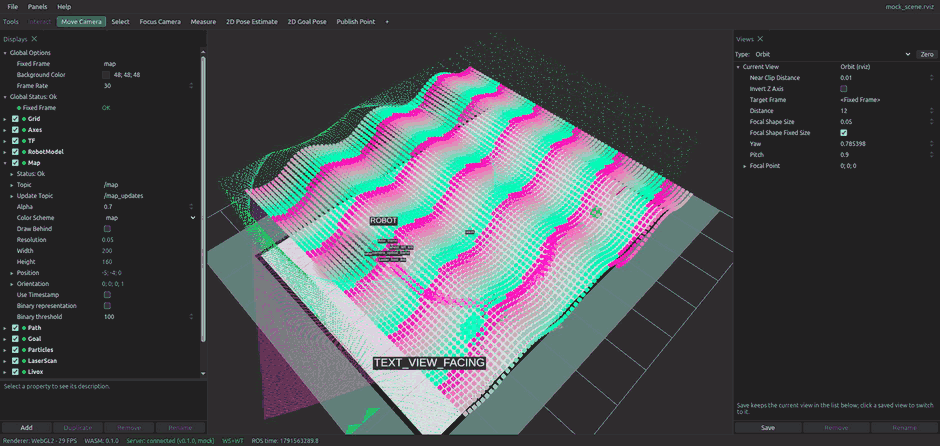
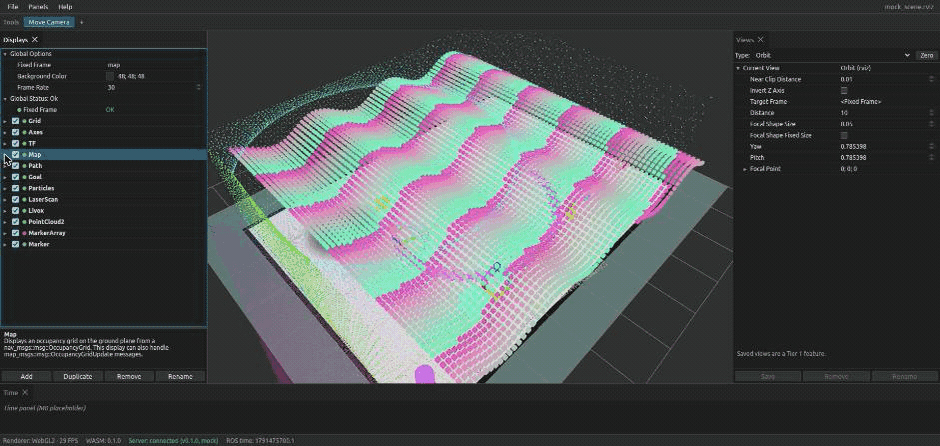
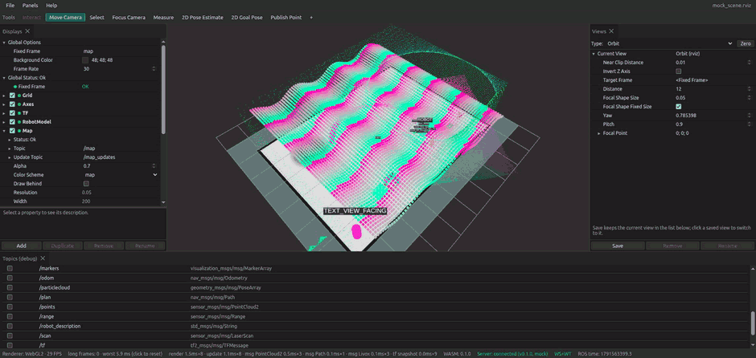

# WebRvizLite

ROS 2 visualization in the browser, modelled on RViz 2 (lyrical, rviz2 15.2.6):
same panels, property names, defaults and `.rviz` config format. Rendering is
three.js (WebGPU with WebGL2 fallback) and only chases performance.



*`make mock-rust`: the mock scene with no ROS 2 installed. Left drag orbits, wheel zooms, `Z` resets the view.*

## Layout

| Path | What |
| --- | --- |
| `crates/core` | Shared no_std-friendly core: wire protocol, CDR decoding, tf2 buffer, point cloud transforms |
| `crates/wasm` | wasm-bindgen wrapper of `core` for the Web Worker |
| `crates/bridge` | ROS 2 transport trait + r2r implementation |
| `crates/server` | axum server: WebSocket bridge + embedded frontend, one executable |
| `web/` | Vite + SolidJS + three.js + dockview frontend |
| `fixtures/` | Test `.rviz` files, CDR samples |
| `docker/` | ROS 2 Humble build/dev container |

## Build

Prerequisites: Rust stable with the `wasm32-unknown-unknown` target, Node ≥ 22,
and (from M1 on) a sourced ROS 2 environment for the r2r bridge.

```sh
make build            # wasm-pack → vite build → cargo build --release (mock transport only)
make mock-rust        # rebuild, then run the server with its built-in Rust mock scene (no ROS)
make mock-rust-tier1  # same scene, fixtures/tier1_scene.rviz (every Tier 1 display, panel and saved view)
```

Two mocks exist: `make mock-rust` is the server's own Rust `MockTransport`
(host, nothing on ROS, full-scale scene); `make docker-mock-ros` is an rclpy node in
the container publishing the same scene on real ROS 2 topics for the r2r
bridge (see below).

Build fails to load the workspace on a newer cargo? See
[`docs/build-troubleshooting.md`](docs/build-troubleshooting.md).
Server starts but the browser cannot connect, or the UI is stale? See
[`docs/running.md`](docs/running.md).
Known problems that are traced but not fixed yet? See
[`docs/todo.md`](docs/todo.md).

Open <http://127.0.0.1:8765>. `--mock` serves a synthetic scene (`/scan` 10 Hz,
`/livox/lidar` 10 Hz, `/tf` 30 Hz, `/tf_static`, `/clock`) and needs no ROS. Append `?debug` to open
the topic debug panel (graph, subscribe toggles, receive rates), `?webgl` to
force the WebGL2 backend.

Real ROS 2 support is the `r2r` cargo feature and must be built inside a
sourced ROS 2 environment (see Docker below):

```sh
cargo build --release -p webrvizlite-server --features r2r
./target/release/webrvizlite --port 8765 --ros-args -p use_sim_time:=true
```

Development with HMR:

```sh
make dev              # Rust server on :8765 + Vite dev server on :5173 (proxies /ws)
```

### Without ROS 2 on the host

```sh
make docker-build     # builds webrvizlite-dev (ros:humble-ros-base + Rust + Node)
make docker-shell     # interactive shell with ROS sourced, repo mounted at /ws
make docker-build-ros # wasm + web + cargo --features r2r, inside the container
make docker-run-ros   # ROS-enabled server on http://127.0.0.1:8766 (host network)
make docker-mock-ros  # rclpy publisher of the same scene on real ROS 2 topics, for testing
```

The container uses host networking so DDS discovery works against the robot's
graph. Set `ROS_DOMAIN_ID` in the environment if needed. r2r resolves message
typesupport at build time: the bridge can only subscribe to types whose package
is both installed in the image (`docker/Dockerfile`; `ros-base` lacks e.g.
`map_msgs`) and listed in `IDL_PACKAGE_FILTER` (`docker/compose.yml`). After
adding a package, clear r2r's generated bindings before rebuilding:
`docker compose -f docker/compose.yml run --rm dev cargo clean --release -p r2r_msg_gen -p r2r`.
`livox_ros_driver2/msg/CustomMsg` (Livox native point clouds, `xfer_format: 1`)
is covered by a message-only copy of the upstream package in `docker/livox_msgs`
that the image builds into `/opt/livox_ws`; the display class is
`webrvizlite/LivoxCustomMsg` (reflectivity → `intensity`, plus `tag`, `line`,
`offset_time` channels).

## Protocol

One WebSocket per browser tab at `/ws`. Binary frames carry raw CDR:
`u8 kind | u32 subscription_id | u64 receive_time_ns | payload` (little-endian).
Text frames are JSON control messages with an `op` field; the types live in
`crates/core/src/protocol.rs` and are shared by the server and the WASM worker.
The server keeps one ROS subscription per distinct `(topic, type, qos)` and
applies per-client backpressure: best effort keeps only the newest frame,
reliable keeps at most `depth` frames.

Best-effort topics additionally travel over **WebTransport** (QUIC on the same
port number, UDP) when the browser supports it: the server generates a
self-signed ECDSA certificate at startup (valid 14 days, as Chrome's
`serverCertificateHashes` requires) and hands its hash plus a per-session token
to the browser in `hello`; frames that fit go as datagrams, larger ones (point
clouds, images) as one unidirectional stream each, with at most two in flight so
a slow link drops frames instead of queueing latency. Anything that fails falls
back to the WebSocket; `--no-webtransport` turns the endpoint off. The status
bar shows `WS+WT` while it is active and the `?debug` panel has a `Via` column.
A page served over plain `http://` from another host is not a secure context,
so there the browser stays on the WebSocket.

## CLI

```
webrvizlite [-d config.rviz] [-f FRAME] [-t FORMAT] [-s IMAGE] [--bind ADDR] [--port N] [--web-dir DIR]
            [--package-path NAME=DIR]... [--no-webtransport] [--mock]
```

`--web-dir` serves the frontend from a directory instead of the embedded build;
`--mock` uses the built-in synthetic transport. `--package-path NAME=DIR` adds a
`package://NAME/...` root for `/api/mesh` (meshes of MESH_RESOURCE markers and
RobotModel) next to the ament index; `--mock` adds
`webrvizlite_fixtures=fixtures/` by itself. Anything after `--ros-args` is
passed to rcl.



*Displays panel: the same tree, property names and Add Display dialog as RViz.*

## Shortcuts

Chrome reserves Ctrl+N / Ctrl+T / Ctrl+W, so a few RViz bindings differ
(`web/src/app/shortcuts.ts` is the single table; Help → About lists it too).

| Action | WebRvizLite | RViz |
| --- | --- | --- |
| Open / Save / Save As | Ctrl+O / Ctrl+S / Ctrl+Shift+S | same |
| Add Display | Ctrl+Alt+N | Ctrl+N |
| Duplicate / Remove / Rename Display (Displays tree focused) | Ctrl+D / Delete (Ctrl+X) / F2 | Ctrl+D / Ctrl+X / Ctrl+R |
| Tools (3D view focused) | i m s c n p g u, Esc = default tool | same |
| Reset view | Z | Z |
| Fullscreen | F11 | F11 |

Save writes back where the config came from: the `-d` file through the
server, a file opened with the File System Access API in place, otherwise a
download. Recent configs are kept in localStorage (file handles in IndexedDB).

## Mock scene

`fixtures/mock_scene.rviz` with `--mock` shows every Tier 0 display: a map
with the three colour schemes, a path with pose arrows, goal pose, particle
cloud, laser scan, a 300k-point PointCloud2 at 10 Hz, a 24k-point Livox
CustomMsg rosette scan, a MarkerArray with every marker type plus 5,000 cubes,
and the robot model. `fixtures/tier1_scene.rviz` (`make mock-rust-tier1`) adds
the Tier 1 displays: Odometry (`/odom`), PoseWithCovariance (`/amcl_pose`),
PointStamped, Polygon footprint, GridCells, Range, two Image panels
(`/camera/image_raw` rgb8 and `/camera/depth/image_raw` 16UC1, ray-cast from
the robot's camera) and a Camera panel, with all five RViz panels and two saved
views. `?perf` adds frame-time counters to the status bar; `?debug` opens the
topic panel.

## Tier 1 features

- **Displays:** RobotModel (URDF from `/robot_description` or a file, meshes via
  `/api/mesh`, Links tree in the four RViz styles, mass / inertia), Odometry,
  PoseWithCovariance (position ellipsoid, orientation discs or 2-D yaw sector),
  PointStamped, Polygon, GridCells, Range, Image (own panel, depth
  normalisation with median window), Camera (own panel: the scene rendered
  through the CameraInfo intrinsics behind / over the image, per-display
  Visibility).
- **Tools:** 2D Pose Estimate, 2D Goal Pose, Publish Point (published through
  the server as JSON), Select (rubber band, Shift/Ctrl, F to focus), Focus
  Camera, Measure. Picking is a colour-ID render pass over the picked box, so
  single point-cloud points, marker instances, poses and TF frames are
  selectable and listed in the Selection panel with their values.
- **Views:** TopDownOrtho and FPS, saved views in the Views panel (Save /
  Remove / Rename, click to switch), `Saved:` round-trips in `.rviz`.
- **Panels:** Time (ROS / wall clocks, Pause freezes ROS time and tf for every
  display), Tool Properties, Selection. The dockview layout is saved under the
  `WebRvizLite Layout` key and restored on load; without it the RViz default
  is built from the file's `Panels` list; `Window Geometry` gets each open
  panel's `collapsed` flag.
- **Transport:** WebTransport for best-effort topics (see Protocol).

Not in Tier 1: the Interact tool and InteractiveMarkers, compressed image
transports, Description File picking through a file dialog (the property is a
plain path string).



*`?debug&perf`: subscribe to topics by hand and watch receive rates; the status bar shows per-display frame times.*

## Tests

```sh
make test             # cargo test --workspace && vitest
make check            # clippy -D warnings, rustfmt, tsc
```
