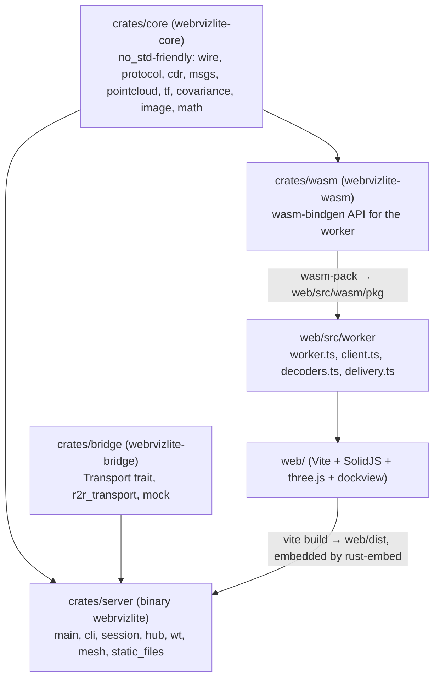
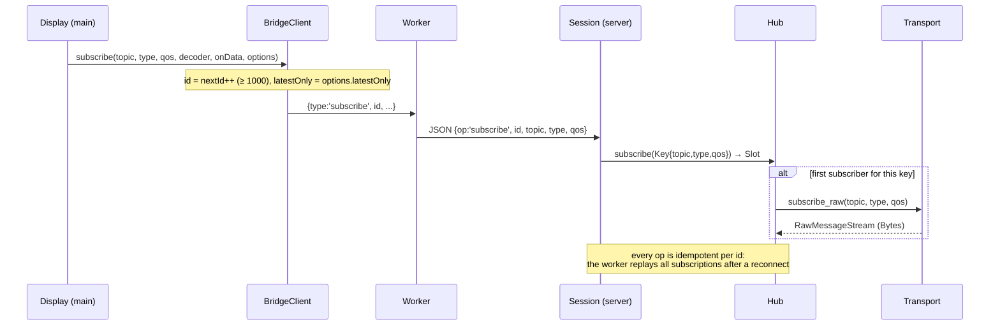
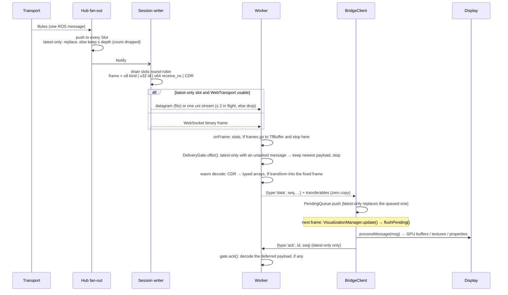
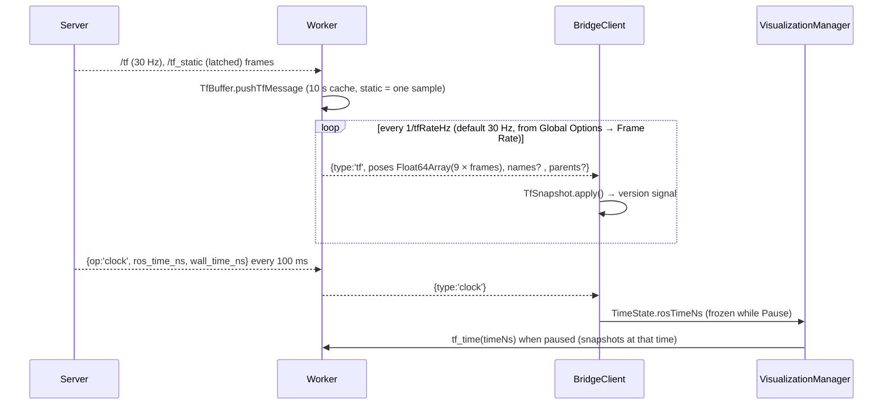
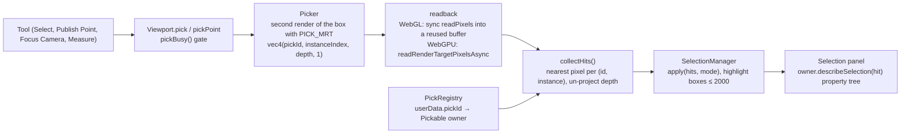
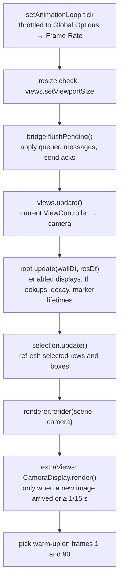
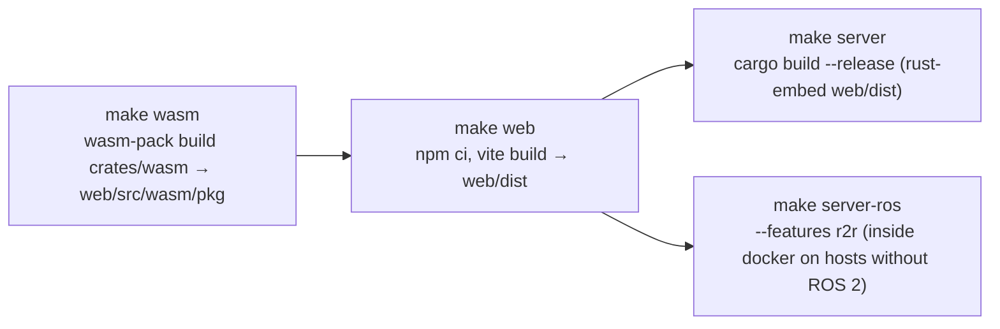

# WebRvizLite architecture

繁體中文版：[architecture.zh-TW.md](architecture.zh-TW.md)

WebRvizLite is rviz2 in a browser tab: one executable (`webrvizlite`) bridges a
ROS 2 graph to WebSocket/WebTransport and serves the embedded frontend; the
browser decodes CDR in a Web Worker through a WASM build of the shared Rust
core and renders with three.js (WebGPU, WebGL2 fallback). It reads and writes
rviz `.rviz` files. Tier 0 covers the core displays (Grid, Axes, TF, Map, Path,
Pose, PoseArray, LaserScan, PointCloud2, Livox, Marker, MarkerArray); Tier 1
adds RobotModel, Odometry, PoseWithCovariance, PointStamped, Polygon,
GridCells, Image, Camera, Range, the pose / select / measure / focus / publish
tools, TopDownOrtho and FPS views, dock panels and WebTransport.

This document has five parts: the overview diagrams (§1), the data flows (§2),
the system design (§3), the trade-offs behind it (§4) and the implementation
map (§5). Performance numbers live in [perf-tier1-vs-tier0.md](perf-tier1-vs-tier0.md)
and [perf-static-analysis.md](perf-static-analysis.md) and are only referenced here.

## 1. Overview

### 1.1 System diagram

```mermaid
flowchart LR
  subgraph ROS["ROS 2 graph"]
    topics["topics: /tf, /points, /markers, ..."]
  end

  subgraph SERVER["webrvizlite executable (Rust, tokio)"]
    direction TB
    transport["Transport trait<br/>r2r (ROS 2) or mock"]
    hub["Hub<br/>one ROS subscription per (topic, type, qos)<br/>per-session slots: latest-only or depth"]
    session["Session<br/>reader: JSON control ops<br/>writer: 13-byte frames, clock 10 Hz"]
    wt["WebTransport endpoint<br/>QUIC/UDP, self-signed cert, token"]
    api["axum routes<br/>/ws  /api/mesh  /api/display-config  static (rust-embed)"]
    transport --> hub --> session
    session --> wt
    session --> api
  end

  subgraph BROWSER["Browser"]
    direction TB
    subgraph WORKER["Web Worker (worker.ts)"]
      sock["WebSocket + WebTransport receive"]
      wasm["webrvizlite-wasm<br/>CDR decode, tf transform, colour transformers"]
      tfbuf["TfBuffer (10 s)<br/>snapshot 30 Hz"]
      gate["DeliveryGate<br/>latest-only: one unacked message"]
      sock --> gate --> wasm
      sock --> tfbuf
    end
    subgraph MAIN["Main thread"]
      client["BridgeClient<br/>PendingQueue, flushPending() per frame"]
      vm["VisualizationManager<br/>root DisplayGroup, views, tools, selection, time"]
      displays["Displays<br/>processMessage() → GPU buffers"]
      viewport["Viewport (three.js WebGPURenderer)<br/>frame loop, Picker, extra views"]
      ui["Solid UI<br/>dockview panels, property tree, .rviz codec"]
      client --> vm --> displays --> viewport
      vm --> ui
    end
    wasm -- "transferables" --> client
    tfbuf -- "tf snapshot" --> client
  end

  topics --> transport
  session -- "WebSocket /ws" --> sock
  wt -- "datagram / uni stream" --> sock
  api -- "GET /api/mesh, /api/display-config" --> ui
```

### 1.2 Crates and packages

`crates/core` is `#![forbid(unsafe_code)]` and builds without `std` (the wasm
crate uses `default-features = false`), so the same decoders, tf buffer and
protocol types run natively in the server and in the browser.

## 2. Data flow

### 2.1 Subscribing

The worker owns two reserved subscriptions (`/tf` id 1, `/tf_static` id 2,
spec §4.3): displays never subscribe to tf themselves.

### 2.2 Message path

Three things make the main thread cheap: the worker transforms into the fixed
frame at decode time (`tf_status` reports stale or missing transforms), the
typed arrays are transferred rather than copied, and messages are applied once
per frame in arrival order.

### 2.3 TF, clock and time

Displays that need poses per frame (TF, Axes, Grid, RobotModel, Camera, Map)
call `TfSnapshot.lookup(frame)` from `update()`; everything with a header is
already in the fixed frame when it arrives.

### 2.4 Publishing, meshes and configuration

- **Publish** (tools): `SetInitialPose`, `SetGoal` and `PublishPoint` build the
  message as JSON in ROS field layout → `BridgeClient.publish` → worker →
  `{op:'publish'}` → `Transport.publish_json` (r2r creates an untyped publisher
  per `(topic, type)`; the mock only logs).
- **Meshes** (RobotModel, mesh markers): `package://` and `file://` URIs go to
  `GET /api/mesh?uri=`; the server resolves `package://` through
  `--package-path NAME=DIR` or `AMENT_PREFIX_PATH/share` and only serves files
  inside a share root. `meshLoader.ts` parses STL/DAE/OBJ and caches per URI.
- **Configuration**: `hello.display_config` tells the browser the server was
  started with `-d file.rviz`; the browser fetches `GET /api/display-config`,
  `RvizConfig` parses the YAML (Panels, Visualization Manager, Window Geometry
  are understood, everything else is kept verbatim), `AppStore` applies the
  dock layout first and then `VisualizationManager.load()`. Save serialises
  the property tree back and `POST /api/display-config` writes the file in
  place. `configIO.ts` handles Open / Save As: the File System Access API in
  secure contexts (handles are kept in IndexedDB so Recent Configs can reopen
  and write them), otherwise a hidden `<input type=file>` that stays attached
  to the document while the dialog is open (a detached one is garbage-collected
  and its `change` event lost) and a download for Save As; files opened that
  way are remembered as text snapshots. The startup config is skipped when the
  user already opened a file before the WebSocket `hello` arrived.

### 2.5 Picking and selection

### 2.6 Browser frame loop

## 3. System design

### 3.1 Layers and boundaries

| Layer | Owns | Must not |
|---|---|---|
| `crates/core` | wire format, control protocol, CDR, message decoders, tf buffer, point/colour transforms, covariance maths, image conversion | depend on tokio, r2r or the DOM; allocate `std` types outside the `std` feature |
| `crates/bridge` | the `Transport` trait and its two implementations | know about sessions or frames |
| `crates/server` | HTTP/WS/WT endpoints, session lifecycle, subscription sharing, backpressure | parse message contents (it forwards CDR as opaque bytes) |
| `crates/wasm` | a thin `wasm_bindgen` surface over `core` for the worker | contain logic that cannot be unit-tested natively |
| worker (`web/src/worker`) | sockets, wasm, tf buffer, decode, the delivery gate | touch three.js or the DOM |
| main thread | displays, rendering, UI, config | see raw message objects (spec §3): only typed arrays and small metadata cross the boundary |

### 3.2 Threading

- **Server**: a tokio multi-thread runtime. Each WebSocket gets a reader task
  (control ops) and a writer task (frames, clock, topic list); the hub runs one
  fan-out task per shared subscription. With r2r, a dedicated `r2r-spin` OS
  thread alternates `spin_once(10 ms)` with a job queue; every node access
  goes through `with_node()` on that thread (a mutex around the node would
  starve callers). Blocking calls (`subscribe`, `publish`, `list_topics`) run
  in `spawn_blocking`.
- **Browser**: one Web Worker per tab owns the connections and all decoding;
  the main thread only applies decoded results at the start of each frame.
  Solid signals drive the UI; the frame loop is outside any Solid computation,
  so per-frame property reads are plain function calls.

### 3.3 Subscription sharing and backpressure

- The hub keys ROS subscriptions by `(topic, type, qos)`; viewers with the same
  key share one DDS subscription. `TransientLocal` keys latch the last payload
  for late joiners; the last detach aborts the task and the ROS subscription.
- Each session gets a **slot** per subscription: `latest_only` (best-effort
  QoS) keeps exactly one frame, reliable keeps `depth` frames and drops the
  oldest; both count `dropped`. A slow client therefore costs a bounded amount
  of memory and never stalls the ROS side.
- Over **WebTransport** latest-only frames go as a datagram when they fit, or
  one unidirectional stream each with at most two in flight; a third frame is
  dropped rather than queued. Any failure marks the WT session broken and the
  WebSocket carries everything.
- In the **browser** the same idea is repeated: displays declare
  `latestOnly()`; the worker decodes at most one unacked message per such
  subscription (`DeliveryGate`), and `BridgeClient` applies at most one per
  frame (`PendingQueue`, a single FIFO so cross-topic order is kept). Displays
  that accumulate state (Marker/MarkerArray, map updates, Odometry,
  PointStamped, RobotModel) stay on ordered delivery.

### 3.4 QoS

`QosProfile {depth, history, reliability, durability}` is shared by the
protocol, the server and the browser; defaults are `keep_last(5)`, reliable,
volatile. The r2r transport maps it 1:1 onto rmw QoS. Displays expose the
rviz QoS rows under their Topic property, and a few follow rviz's hard-coded
choices (CameraInfo uses SensorDataQoS, RobotModel subscribes transient-local
with depth 1 until the rows are edited).

### 3.5 Rendering

- `Viewport` creates `THREE.WebGPURenderer`; after `init()` the backend is
  WebGPU or WebGL2 (`?webgl` forces the fallback). All materials are TSL node
  materials so one code path serves both backends.
- A `Display` is a property subtree with a lifecycle: `initialize(ctx)` adds
  its `sceneNode` to the scene, `onEnable`/`onDisable` subscribe and
  unsubscribe, `update(wallDt, rosDt)` runs per frame while enabled,
  `processMessage` applies decoded data, `dispose` releases GPU objects and
  pick ids. Displays inside a Group share the same `DisplayContext`.
- Large sets are instanced: point clouds (sprites/instances per point, Uint8
  colours), markers (`InstancedShapes` pools per shape), Odometry arrows/axes
  and the covariance ellipsoids/discs/sectors (three pools per display), TF
  axes and arrows per frame.
- Picking is a colour-ID pass (§2.5) rather than CPU raycasting: it works for
  every object kind, including instanced sprites, and costs one extra render
  of the picked box.
- `ExtraView`s (Camera display panels) render the same scene with a second
  renderer after the main view; Visibility is applied by hiding scene nodes
  for the duration of that render.

### 3.6 Properties and configuration

- `Property` implementations (`web/src/property/Property.ts`) hold Solid
  signals for value, name, hidden, read-only and children; `onChange(cb)`
  reports the change source (`user`, `config`, `program`). The tree view is
  virtualised and renders only visible rows.
- Save/load follows rviz rules: a property with children serialises as
  `{Value, child…}`, read-only rows are not saved, unknown keys are kept so a
  config written by rviz round-trips unchanged, and an unknown display class
  becomes `UnknownDisplay` so one bad display never breaks the file (spec
  §9.8). Views, Tools and the dock layout (`WebRvizLite Layout`) are part of
  the same document.

### 3.7 Extension points

Adding a display takes five steps, each in its own layer:

1. `crates/core/src/msgs/*.rs`: a CDR decoder with a native unit test.
2. `crates/wasm/src/lib.rs`: a `TfBuffer::decode_*` method that transforms
   into the fixed frame and returns a result struct whose arrays are moved out
   with `take_*`.
3. `web/src/worker/decoders.ts`: a `registerDecoder` entry that reads each
   array once, lists the buffers as transferables and frees the object.
4. `web/src/displays/<name>Display.ts`: a class deriving from
   `RosTopicDisplayBase` or `MessageFilterDisplayBase` with the rviz property
   names and `latestOnly()`.
5. `web/src/displays/registry.ts`: the rviz class id.

Tools (`web/src/tools`, `ToolManager`), views (`web/src/views`,
`ViewManager`) and panels (`web/src/app/layout.ts` `PANELS`) each have a
registry with the same shape.

### 3.8 Time

`TimeState` exposes ROS time from the server clock (sim time when the node
runs with `use_sim_time`); Pause freezes it and asks the worker to snapshot tf
at that time (`tf_time`). Displays get `wallDt` and `rosDt` per frame so decay
and lifetimes follow the right clock.

### 3.9 Security boundaries

The server binds `127.0.0.1` by default. WebTransport sessions are only
accepted with the per-session token from `hello`, and the certificate hash is
pinned by the browser. `/api/mesh` refuses paths outside the package share
roots. Config Save writes only the file the server was started with.

## 4. Trade-offs

| Choice | Cost | Why |
|---|---|---|
| Decode in the worker through WASM, transfer typed arrays | Every message is copied into wasm memory and once out; decoders are duplicated in Rust rather than written in TS | The main thread stays at ~1 ms per frame with 300k points at 10 Hz; decoders are unit-tested natively and shared with the server |
| Transform into the fixed frame at decode time | Changing the Fixed Frame cannot re-transform data already received: displays wait for the next message (see `todo.md`) | No per-point work on the main thread; the message carries `inFixedFrame`/`tfError` instead of the display asking tf per frame |
| One ROS subscription per `(topic, type, qos)` | Two viewers asking for different depths of the same topic create two DDS subscriptions | Exact QoS semantics per viewer; no hidden downgrade |
| Latest-only slots (server) and the ack gate (browser) | A slow consumer sees fewer frames; one frame of extra latency for latest-only topics | Bounded memory on both sides, no queue of stale clouds; ordered delivery is kept for displays that accumulate |
| WebTransport for best-effort topics | Self-signed 14-day certificate, a token handshake, unordered datagrams, a second endpoint to run | Large clouds and images stop sharing head-of-line blocking with reliable topics; everything degrades to the WebSocket |
| Instanced pools instead of one mesh per item | Per-instance attributes and TSL materials are more code than `new Mesh` | 5,000 markers or 100 odometry poses are a handful of draw calls |
| Colour-ID picking instead of raycasting | One extra render and a GPU readback per pick; pipelines compile on first use (warm-up picks mitigate) | Works uniformly for sprites, instances, lines and meshes; returns depth and instance ids |
| Solid signals in the property tree | Each property is several signals; multi-child edits must be batched | The Displays panel, editors and status rows update without a diffing framework; rviz's model maps directly |
| `ComboEditor` for Topic / frame fields (`property/editors.tsx`) | A custom popup (Solid `Portal`, `position: fixed`) instead of a native `<datalist>` | A datalist only lists entries matching the typed text, so a field holding `/scan` showed nothing else; the portal escapes the tree's overflow and dockview clipping. TF frame properties read the frame list from the tf snapshot through `setTfFrameSource` |
| Stable tree rows (`flattenRows` reuse map) | Row objects are reused by path when unchanged | The keyed `<For>` keeps editors mounted while status rows come and go, so an open popup or half-typed text survives |
| rviz `.rviz` YAML compatibility | Unknown keys and unknown classes must be preserved rather than modelled | Existing rviz configs open unchanged and save back without loss |
| Frontend embedded in the binary (`rust-embed`) | A frontend change needs a Rust rebuild; `--web-dir` exists for development | One file to copy to a robot; no separate web server |
| Built-in mock transport | The mock must mirror the real topics by hand (`tools/mock_scene.py` mirrors it for ROS) | Develop and measure without a ROS 2 install; the spec's performance target is reproducible |
| r2r with a spin thread | Every node call pays up to one spin period (10 ms) of latency | No mutex starvation between subscriptions and service calls |
| Camera view rendered at ≤ 15 Hz | Camera panels lag moving geometry by up to 66 ms (rviz redraws every frame) | The second full scene render was the largest per-frame cost (`perf-static-analysis.md` §1.1) |
| `core` kept `no_std`-friendly | `alloc`-only code, `libm` for maths, no `serde_json` without `std` | One crate serves the server and the wasm build without feature drift |
| Approved deviations from the spec | No `troika-three-text` (text is CanvasTexture sprites), `dockview` instead of `dockview-core`, point-cloud Points style via instances | troika does not work with WebGPURenderer; dockview-core ships no CSS; `THREE.Points` is fixed at 1 px on WebGPU |
| Picking keeps a full scene traversal to hide helpers | O(objects) per pick | three.js layers are not inherited, and a registry would have to track every object a display adds later |

## 5. Implementation

### 5.1 Repository map

| Path | Contents |
|---|---|
| `crates/core/src` | `wire.rs` frame header · `protocol.rs` control ops, QoS · `cdr.rs` reader/writer · `msgs/{common,geometry,marker,nav,pointcloud,sensor,std_msgs,tf}.rs` · `pointcloud.rs` transformers · `tf.rs` buffer · `covariance.rs` · `image.rs` · `math.rs` |
| `crates/bridge/src` | `lib.rs` `Transport` trait · `r2r_transport.rs` · `mock.rs` |
| `crates/server/src` | `main.rs` routes · `cli.rs` · `session.rs` · `hub.rs` · `wt.rs` · `mesh.rs` · `static_files.rs` · `build.rs` |
| `crates/wasm/src/lib.rs` | `TfBuffer`, `decode*`, `ImageConverter`, `FrameHeader`, `pointInfoJson`, result classes with `take*` |
| `web/src/app` | `App.tsx` menus/toolbar/status bar · `store.ts` `AppStore` · `layout.ts` dockview + `PANELS` · `bridge.ts` · `configIO.ts` · `selection.ts` · `shortcuts.ts` |
| `web/src/displays` | `Display.ts` base classes · `types.ts` · `manager.ts` · `registry.ts` · one file per display · `pointCloudCommon.ts`, `covarianceProperty.ts`, `selectionInfo.ts` |
| `web/src/render` | `Renderer.ts` Viewport · `picking.ts` · `tf.ts` · `instanced.ts`, `instancedShapes.ts`, `pointCloud.ts`, `primitives.ts`, `covarianceVisual.ts`, `poseShape.ts` · `meshLoader.ts`, `urdf.ts` · `mapPalette.ts` · `input.ts` · `perf.ts` |
| `web/src/worker` | `worker.ts` · `client.ts` · `messages.ts` · `decoders.ts` · `delivery.ts` |
| `web/src/tools`, `web/src/views`, `web/src/panels`, `web/src/property`, `web/src/config` | tools and `ToolManager` · view controllers and `ViewManager` · dock panels · property model, tree and editors · `rvizConfig.ts` |
| `web/e2e`, `web/playwright.config.ts` | Playwright E2E: `start-server.mjs` (mock server on a scratch copy of `fixtures/default.rviz`) · `config.spec.ts` (Open / Save / Save As / Recent Configs) · `.tmp/` is ignored |
| `fixtures/` | `.rviz` scenes (`mock_scene`, `tier1_scene`, nav2 samples) and `robot_description/` URDF + meshes |
| `tools/mock_scene.py` | rclpy publisher of the mock scene for the r2r path |
| `docker/` | ROS 2 Humble build container, compose file, livox msgs |
| `conf/cyclonedds.xml` | CycloneDDS unicast profile |

### 5.2 Build pipeline

- `make build` runs the three steps; `make dev` runs the server with
  `--web-dir web/dist` plus the Vite dev server (port 5173, proxying `/ws` and
  `/api` to 8765). `make check` = clippy `-D warnings`, `cargo fmt --check`,
  `tsc --noEmit`; `make test` = `cargo test --workspace` + vitest;
  `make test-e2e` builds the server and runs the Playwright suite in
  `web/e2e/` against Google Chrome (`channel: 'chrome'`, no browser download).
- `make mock-rust` / `make mock-rust-tier1` start `--mock` with the two fixture
  scenes; `make docker-*` build and run the ROS flavour in the Humble image.
- Version: one for the whole repo, `[workspace.package] version` in the root
  `Cargo.toml` (`0.2.0-dev` while in development); the crates inherit it and
  `vite.config.ts` reads it for the frontend. `build.rs` of server and wasm and
  `define` in `vite.config.ts` append `+g<sha>[.dirty]`, shown by `--version`,
  `hello.version`, the status bar and About; differing stamps mean a stale
  part. `make version` prints it.
- Nested crate `target/` directories are ignored (`.gitignore`); use
  `CARGO_TARGET_DIR` when the default target is not writable.

### 5.3 Protocol constants

- Binary frame: `u8 kind (0 = message) | u32 subscription_id | u64 receive_time_ns | CDR payload`, little-endian, 13-byte header, no padding.
- Client → server JSON ops: `subscribe {id, topic, type, qos}`, `unsubscribe {id}`, `list_topics`, `transport {wt}`, `publish {topic, type, qos, msg}`.
- Server → client: `hello {version, ros_distro, mock, use_sim_time, display_config, fixed_frame, wt?: {port, cert_sha256_hex, token}}`, `topics`, `clock {ros_time_ns, wall_time_ns}` (every 100 ms), `error {id?, message}`.
- Routes: `/ws`, `/api/health`, `/api/display-config` (GET/POST), `/api/mesh?uri=`, static fallback to `index.html`.
- CLI: `-d/-f/-t/-s`, `--fullscreen`, `--bind` (127.0.0.1), `--port` (8765), `--web-dir`, `--package-path NAME=DIR`, `--no-webtransport`, `--mock`, `--ros-args`.

### 5.4 Worker ⇄ main messages

| Direction | Types |
|---|---|
| main → worker | `subscribe`, `unsubscribe`, `options`, `list_topics`, `publish`, `stats`, `set_fixed_frame`, `tf_rate`, `tf_time`, `describe_point`, `ack` |
| worker → main | `wasm`, `ws`, `topics`, `clock`, `error`, `stats` (with `wasmBytes`), `point_info`, `transport`, `tf`, `data` (`seq`, `decoder`, `stampNs`, `frameId`, `inFixedFrame`, `tfError`, `data`) |

Decoders: `none`, `tf`, `laser_scan`, `livox_custom_msg`, `point_cloud2`,
`occupancy_grid`, `occupancy_grid_update`, `path`, `pose_stamped`,
`pose_array`, `marker`, `marker_array`, `pose_with_covariance`, `odometry`,
`point_stamped`, `polygon`, `grid_cells`, `range`, `string`, `image`,
`camera_info`.

### 5.5 Displays, tools, views, panels

| Display class id | Base class | latestOnly |
|---|---|---|
| `rviz_default_plugins/Grid`, `Axes`, `TF`, `RobotModel` | `DisplayBase` (RobotModel subscribes `/robot_description` itself) | – |
| `Map` | `RosTopicDisplayBase` (+ map updates subscription) | grid yes, updates no |
| `Path`, `Pose`, `PoseArray`, `PointCloud2`, `LaserScan`, `webrvizlite/LivoxCustomMsg` | `MessageFilterDisplayBase` | Path when Buffer Length = 1; clouds when Decay Time = 0; Pose/PoseArray yes |
| `Marker`, `MarkerArray` | `MessageFilterDisplayBase` | no (ADD/DELETE semantics) |
| `PoseWithCovariance`, `Odometry`, `PointStamped`, `Polygon`, `GridCells`, `Range` | `MessageFilterDisplayBase` | PoseWithCovariance, Polygon, GridCells yes; Range when Buffer Length = 1; Odometry, PointStamped no |
| `Image`, `Camera` | `RosTopicDisplayBase` (Camera is also an `ExtraView`) | yes |

Tools: `MoveCamera`, `Select`, `SetInitialPose`, `SetGoal`, `FocusCamera`,
`Measure`, `PublishPoint` (`Interact` is listed but unavailable). Views:
`Orbit`, `TopDownOrtho`, `FPS` (unknown classes are driven as Orbit and keep
their id). Panels: `view3d`, `displays`, `views`, `toolProps`, `selection`,
`time`, `debug`, `image`, `camera`.

### 5.6 Mock scene

`--mock` publishes an 8 × 6 m room with a robot driving a 2 m circle:
`/scan` 10 Hz, `/livox/lidar` 10 Hz, `/points` (300k points) 10 Hz, `/tf`
30 Hz, `/tf_static`, `/clock` 50 Hz, `/map` and `/robot_description`
(latched), `/markers` and `/marker` 1 Hz, `/odom` 20 Hz, `/range` 10 Hz,
`/footprint` 5 Hz, `/clicked_point_echo` 2 Hz, `/amcl_pose`, `/grid_cells`
1 Hz, `/camera/image_raw`, `/camera/depth/image_raw`, `/camera/camera_info`
5 Hz, `/plan`, `/goal_pose`, `/particlecloud` 2 Hz. TF: `map → odom →
base_footprint → base_link → {wheels, caster, camera_link → camera_optical_frame,
laser, livox_frame}`.

### 5.7 Tests and tooling

- Rust: inline `#[cfg(test)]` modules in `core` (protocol, cdr, pointcloud,
  math, wire, tf, covariance, image, every `msgs/*`), `server/hub.rs` and
  `bridge/mock.rs`; `cargo test --workspace`.
- Web (vitest, jsdom where the DOM or three.js is involved): `config/rvizConfig`,
  `app/{configIO, store}`, `property/Property`, `displays/robotModel`,
  `render/{urdf, picking, mapPalette, covarianceVisuals}`,
  `worker/{delivery, client}`, `views/{orbit, views}`. `configIO.test.ts`
  stubs the pickers and IndexedDB; `store.test.ts` builds `AppStore` with a
  fake bridge and layout.
- E2E (Playwright, `web/e2e/config.spec.ts`, `make test-e2e`): `start-server.mjs`
  copies `fixtures/default.rviz` to `web/e2e/.tmp/server.rviz` and starts
  `--mock -d` on it; `playwright.config.ts` also starts Vite. The specs cover
  Open through the real Chrome file dialog (driven over CDP with a forced GC,
  which is what broke the detached input), Recent Configs after a reload, Save
  As and Ctrl+S downloads, Ctrl+S writing the server file, and the File System
  Access path with stubbed pickers. The Displays tree is virtualised, so the
  specs assert on its scrolled tail; traces are off because the WebGL page
  produces truncated ones.
- Performance: `?perf` shows FPS, long frames and the worst time per section
  (`web/src/render/perf.ts`); `?debug` opens the Debug panel with per-topic
  Hz, bytes, dropped frames, transport and wasm memory. The measurement
  procedure and probes are described in `perf-tier1-vs-tier0.md`.
- There is no CI configuration in the repository.

## Appendix

- **Glossary**: *slot* = per-session queue of one subscription in the hub;
  *latest-only* = best-effort delivery that keeps the newest frame only;
  *fixed frame* = rviz's reference frame all data is transformed into;
  *ExtraView* = a render pass after the main view (Camera panel);
  *pick id* = per-object integer written by the pick pass.
- **Other documents**: [build-troubleshooting.md](build-troubleshooting.md),
  [running.md](running.md), [todo.md](todo.md) (known issues and deliberate
  rviz deviations), [perf-tier1-vs-tier0.md](perf-tier1-vs-tier0.md),
  [perf-static-analysis.md](perf-static-analysis.md).
- **"spec §" references** in code comments point to the project specification,
  which is not stored in this repository (§3 thread rule, §4.3 wire frame,
  §4.4 config codec, §7.3 picking, §9.7 no per-frame allocation, §9.8 one
  broken display must not break the config, and so on).
