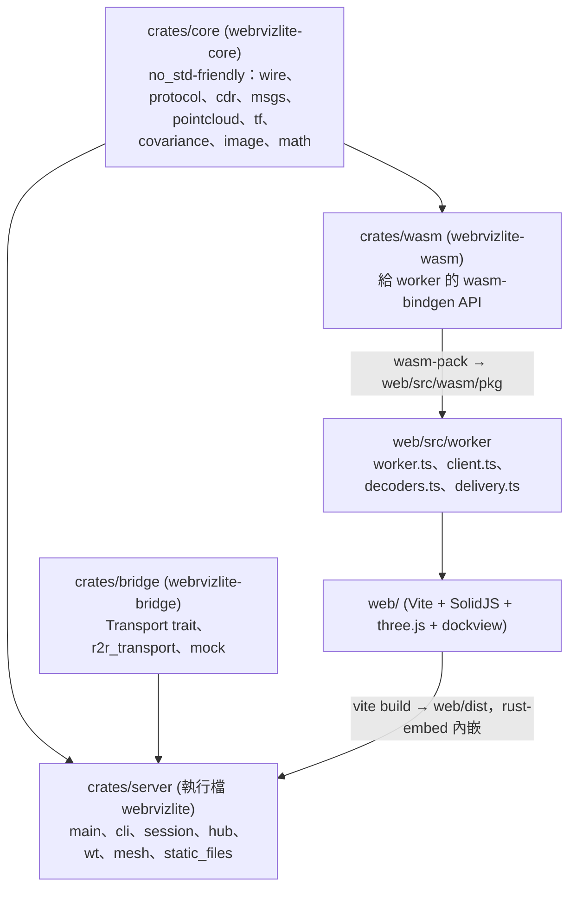
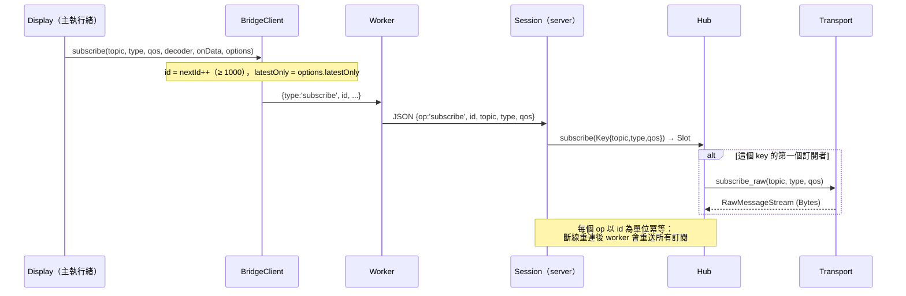
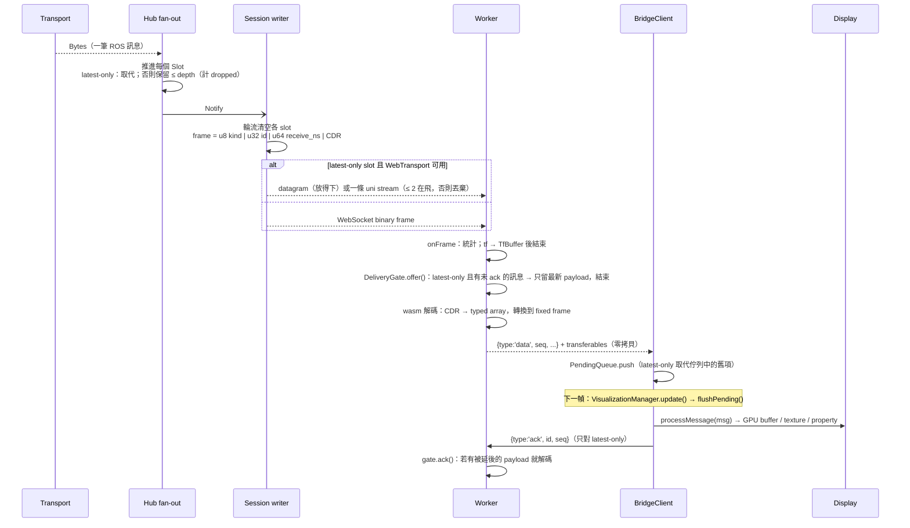
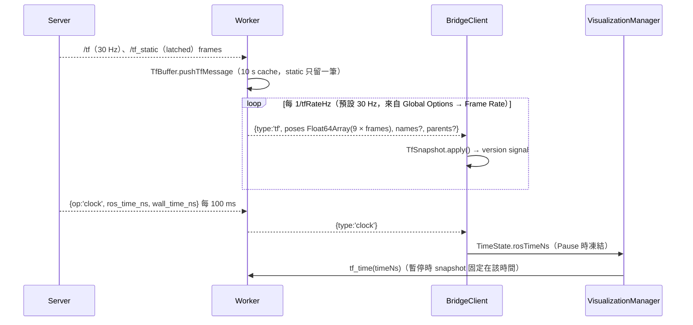
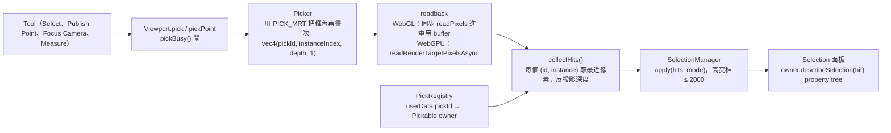
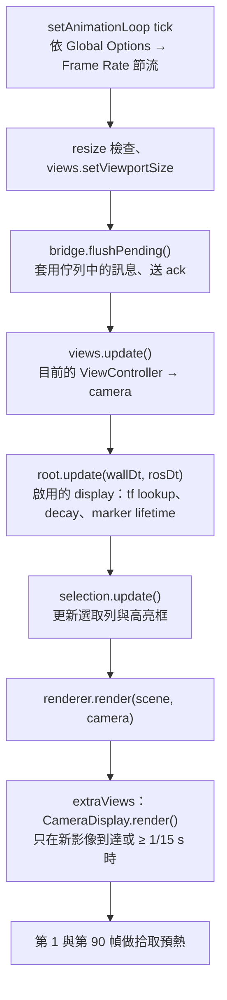
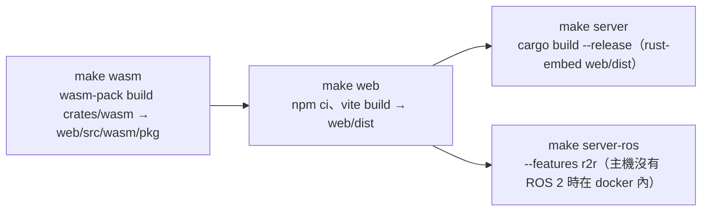

# WebRvizLite 系統架構

English version: [architecture.md](architecture.md)

WebRvizLite 是跑在瀏覽器分頁裡的 rviz2：一個執行檔（`webrvizlite`）把 ROS 2
graph 橋接到 WebSocket / WebTransport 並內嵌前端；瀏覽器端在 Web Worker 裡用
共用 Rust core 的 WASM 版本解 CDR，再交給 three.js（WebGPU，退回 WebGL2）渲
染，並可直接讀寫 rviz 的 `.rviz` 設定。Tier 0 是核心 display（Grid、Axes、
TF、Map、Path、Pose、PoseArray、LaserScan、PointCloud2、Livox、Marker、
MarkerArray）；Tier 1 加上 RobotModel、Odometry、PoseWithCovariance、
PointStamped、Polygon、GridCells、Image、Camera、Range、pose / select /
measure / focus / publish 工具、TopDownOrtho 與 FPS 視圖、dock 面板與
WebTransport。

本文分五部分：總覽圖（§1）、資料流（§2）、系統設計（§3）、取捨（§4）、
實作面（§5）。效能數字在 [perf-tier1-vs-tier0.md](perf-tier1-vs-tier0.md)
與 [perf-static-analysis.md](perf-static-analysis.md)，這裡只引用不重複。

## 1. 總覽

### 1.1 系統架構圖

```mermaid
flowchart LR
  subgraph ROS["ROS 2 graph"]
    topics["topics: /tf, /points, /markers, ..."]
  end

  subgraph SERVER["webrvizlite 執行檔 (Rust, tokio)"]
    direction TB
    transport["Transport trait<br/>r2r (ROS 2) 或 mock"]
    hub["Hub<br/>每個 (topic, type, qos) 一個 ROS 訂閱<br/>每個 session 一個 slot：latest-only 或 depth"]
    session["Session<br/>reader：JSON 控制訊息<br/>writer：13-byte frame、clock 10 Hz"]
    wt["WebTransport 端點<br/>QUIC/UDP、自簽憑證、token"]
    api["axum 路由<br/>/ws  /api/mesh  /api/display-config  靜態檔 (rust-embed)"]
    transport --> hub --> session
    session --> wt
    session --> api
  end

  subgraph BROWSER["瀏覽器"]
    direction TB
    subgraph WORKER["Web Worker (worker.ts)"]
      sock["WebSocket + WebTransport 接收"]
      wasm["webrvizlite-wasm<br/>CDR 解碼、tf 轉換、顏色 transformer"]
      tfbuf["TfBuffer (10 s)<br/>snapshot 30 Hz"]
      gate["DeliveryGate<br/>latest-only：同時只有一筆未 ack"]
      sock --> gate --> wasm
      sock --> tfbuf
    end
    subgraph MAIN["主執行緒"]
      client["BridgeClient<br/>PendingQueue，每幀 flushPending()"]
      vm["VisualizationManager<br/>root DisplayGroup、views、tools、selection、time"]
      displays["Displays<br/>processMessage() → GPU buffer"]
      viewport["Viewport (three.js WebGPURenderer)<br/>幀迴圈、Picker、extra views"]
      ui["Solid UI<br/>dockview 面板、property tree、.rviz codec"]
      client --> vm --> displays --> viewport
      vm --> ui
    end
    wasm -- "transferables" --> client
    tfbuf -- "tf snapshot" --> client
  end

  topics --> transport
  session -- "WebSocket /ws" --> sock
  wt -- "datagram / uni stream" --> sock
  api -- "GET /api/mesh, /api/display-config" --> ui
```

### 1.2 crate 與套件相依

`crates/core` 是 `#![forbid(unsafe_code)]` 且可以不帶 `std` 建置（wasm crate 用
`default-features = false`），所以同一套解碼器、tf buffer 與協定型別同時跑在
server 原生端與瀏覽器裡。

## 2. 資料流

### 2.1 建立訂閱

worker 自己持有兩個保留訂閱（`/tf` id 1、`/tf_static` id 2，spec §4.3），
display 不會自己訂 tf。

### 2.2 訊息路徑

主執行緒便宜的三個原因：worker 在解碼時就轉進 fixed frame（`tf_status`
回報過期或缺少的 transform）、typed array 用 transfer 而不是複製、訊息每幀
套用一次且依到達順序。

### 2.3 TF、clock 與時間

每幀需要姿態的 display（TF、Axes、Grid、RobotModel、Camera、Map）在
`update()` 裡呼叫 `TfSnapshot.lookup(frame)`；帶 header 的資料到達時已經在
fixed frame 裡。

### 2.4 發佈、mesh 與設定

- **發佈**（工具）：`SetInitialPose`、`SetGoal`、`PublishPoint` 以 ROS 欄位
  配置的 JSON 組訊息 → `BridgeClient.publish` → worker → `{op:'publish'}` →
  `Transport.publish_json`（r2r 依 `(topic, type)` 建一個 untyped publisher；
  mock 只記錄）。
- **Mesh**（RobotModel、mesh marker）：`package://` 與 `file://` URI 走
  `GET /api/mesh?uri=`；server 用 `--package-path NAME=DIR` 或
  `AMENT_PREFIX_PATH/share` 解析 `package://`，且只提供 share root 內的檔案。
  `meshLoader.ts` 解析 STL/DAE/OBJ 並依 URI 快取。
- **設定**：`hello.display_config` 表示 server 以 `-d file.rviz` 啟動；瀏覽器
  `GET /api/display-config`，`RvizConfig` 解析 YAML（Panels、Visualization
  Manager、Window Geometry 看得懂，其餘原樣保留），`AppStore` 先套 dock
  layout 再 `VisualizationManager.load()`。Save 把 property tree 序列化回去，
  `POST /api/display-config` 原地寫檔。`configIO.ts` 負責 Open / Save As：
  安全情境（`https://` 或 `localhost`）用 File System Access API（handle 存在
  IndexedDB，Recent Configs 才能重開並寫回）；否則用隱藏的 `<input type=file>`，
  對話框開著時它必須留在 document 裡（脫離的 input 會被 GC，`change` 事件就
  丟了），Save As 則改成下載；這樣開的檔案以文字快照記住。使用者在 WebSocket
  `hello` 到達前已自行開檔時，啟動設定不會覆蓋它。

### 2.5 拾取與選取

### 2.6 瀏覽器幀迴圈

## 3. 系統設計

### 3.1 分層與邊界

| 層 | 擁有 | 不可以 |
|---|---|---|
| `crates/core` | wire 格式、控制協定、CDR、訊息解碼器、tf buffer、點/顏色轉換、covariance 數學、影像轉換 | 依賴 tokio、r2r 或 DOM；在 `std` feature 之外用 `std` 型別 |
| `crates/bridge` | `Transport` trait 與兩個實作 | 知道 session 或 frame |
| `crates/server` | HTTP/WS/WT 端點、session 生命週期、訂閱共享、背壓 | 解析訊息內容（CDR 當不透明 bytes 轉送） |
| `crates/wasm` | 給 worker 的薄 `wasm_bindgen` 介面 | 放無法原生單元測試的邏輯 |
| worker（`web/src/worker`） | socket、wasm、tf buffer、解碼、delivery gate | 碰 three.js 或 DOM |
| 主執行緒 | display、渲染、UI、設定 | 看到原始訊息物件（spec §3）：跨邊界的只有 typed array 與少量 metadata |

### 3.2 執行緒模型

- **Server**：tokio 多執行緒 runtime。每個 WebSocket 一個 reader task（控制
  訊息）與一個 writer task（frame、clock、topic 清單）；hub 每個共享訂閱一個
  fan-out task。用 r2r 時有一條專用 `r2r-spin` OS thread，交替跑
  `spin_once(10 ms)` 與 job queue；所有 node 存取都經 `with_node()` 在那條
  thread 上執行（node 外面包 mutex 會讓呼叫者餓死）。會阻塞的呼叫
  （`subscribe`、`publish`、`list_topics`）跑在 `spawn_blocking`。
- **瀏覽器**：每個分頁一個 Web Worker 擁有連線與全部解碼；主執行緒只在每幀
  開頭套用解碼結果。Solid signal 驅動 UI；幀迴圈在任何 Solid computation 之
  外，所以每幀讀屬性只是普通函式呼叫。

### 3.3 訂閱共享與背壓

- hub 以 `(topic, type, qos)` 當 key；相同 key 的 viewer 共用一個 DDS 訂閱。
  `TransientLocal` 的 key 會 latch 最後一筆給晚到的 slot；最後一個 detach 時
  中止 task 並取消 ROS 訂閱。
- 每個 session 每個訂閱一個 **slot**：`latest_only`（best-effort QoS）只留一
  筆，reliable 留 `depth` 筆並丟最舊；兩者都計 `dropped`。慢的客戶端因此只
  占有界記憶體，也不會卡住 ROS 端。
- **WebTransport** 上 latest-only 的 frame 放得下就走 datagram，否則一條 uni
  stream，最多兩條在飛；第三筆直接丟棄不排隊。任何失敗都把 WT session 標為
  broken，之後全走 WebSocket。
- **瀏覽器**端重複同一個想法：display 宣告 `latestOnly()`；worker 對這類訂閱
  最多解碼一筆未 ack 的訊息（`DeliveryGate`），`BridgeClient` 每幀最多套用一
  筆（`PendingQueue`，單一 FIFO 保住跨 topic 順序）。會累積狀態的 display
  （Marker/MarkerArray、map update、Odometry、PointStamped、RobotModel）維持
  ordered 遞送。

### 3.4 QoS

`QosProfile {depth, history, reliability, durability}` 由協定、server 與瀏覽
器共用；預設 `keep_last(5)`、reliable、volatile。r2r transport 一對一對映到
rmw QoS。display 在 Topic 屬性下露出 rviz 的 QoS 列，少數照 rviz 寫死
（CameraInfo 用 SensorDataQoS，RobotModel 在列被編輯前用 transient-local
depth 1 訂閱）。

### 3.5 渲染

- `Viewport` 建 `THREE.WebGPURenderer`；`init()` 後 backend 是 WebGPU 或
  WebGL2（`?webgl` 強制退回）。所有 material 都是 TSL node material，一套程式
  碼同時服務兩個 backend。
- `Display` 是一棵 property 子樹加生命週期：`initialize(ctx)` 把
  `sceneNode` 加進 scene，`onEnable`/`onDisable` 訂閱與退訂，`update(wallDt,
  rosDt)` 啟用時每幀跑，`processMessage` 套用解碼資料，`dispose` 釋放 GPU 物
  件與 pick id。群組內的 display 共用同一個 `DisplayContext`。
- 大量物件都 instanced：點雲（每點 sprite/instance、Uint8 顏色）、marker
  （每種形狀一個 `InstancedShapes` 池）、Odometry 箭頭/座標軸與 covariance 橢
  球/圓盤/扇形（每個 display 三個池）、TF 每個 frame 的 axes 與 arrow。
- 拾取是 colour-ID pass（§2.5）而不是 CPU raycast：對每種物件（含 instanced
  sprite）一致，代價是框內多畫一次。
- `ExtraView`（Camera display 面板）在主視圖之後用第二個 renderer 畫同一個
  scene；Visibility 以在該次 render 期間隱藏 scene node 來實現。

### 3.6 屬性與設定模型

- `Property` 實作（`web/src/property/Property.ts`）用 Solid signal 持有
  value、name、hidden、read-only 與 children；`onChange(cb)` 回報變更來源
  （`user`、`config`、`program`）。樹狀檢視虛擬化，只渲染可見列。
- 存讀遵循 rviz 規則：有子節點的屬性序列化為 `{Value, child…}`，read-only 不
  存，未知 key 保留讓 rviz 寫的設定能原樣來回，未知 display class 變成
  `UnknownDisplay`，一個壞 display 不會弄壞整份檔案（spec §9.8）。Views、
  Tools 與 dock layout（`WebRvizLite Layout`）都在同一份文件裡。

### 3.7 擴充點

新增一個 display 分五步，各在自己的層：

1. `crates/core/src/msgs/*.rs`：CDR 解碼器與原生單元測試。
2. `crates/wasm/src/lib.rs`：`TfBuffer::decode_*` 方法，轉進 fixed frame，回
   傳的結果結構用 `take_*` 把陣列移出。
3. `web/src/worker/decoders.ts`：一個 `registerDecoder` 項目，每個陣列只讀一
   次、列進 transferables、釋放物件。
4. `web/src/displays/<name>Display.ts`：繼承 `RosTopicDisplayBase` 或
   `MessageFilterDisplayBase`，用 rviz 的屬性名稱並宣告 `latestOnly()`。
5. `web/src/displays/registry.ts`：rviz class id。

工具（`web/src/tools`、`ToolManager`）、視圖（`web/src/views`、`ViewManager`）
與面板（`web/src/app/layout.ts` 的 `PANELS`）各有同樣形狀的註冊表。

### 3.8 時間

`TimeState` 從 server clock 提供 ROS time（node 以 `use_sim_time` 執行時是 sim
time）；Pause 凍結它並要 worker 在該時間 snapshot tf（`tf_time`）。display 每
幀同時拿到 `wallDt` 與 `rosDt`，decay 與 lifetime 各用正確的時鐘。

### 3.9 安全邊界

server 預設綁 `127.0.0.1`。WebTransport session 只接受 `hello` 給的每 session
token，憑證 hash 由瀏覽器釘住。`/api/mesh` 拒絕 package share root 之外的路
徑。設定 Save 只寫 server 啟動時指定的那個檔案。

## 4. 取捨

| 選擇 | 代價 | 為什麼 |
|---|---|---|
| 在 worker 用 WASM 解碼、transfer typed array | 每筆訊息進 wasm 記憶體一次、出來一次；解碼器用 Rust 寫而不是 TS | 300k 點 @10 Hz 時主執行緒每幀約 1 ms；解碼器可原生單元測試並與 server 共用 |
| 解碼時就轉進 fixed frame | 變更 Fixed Frame 無法重轉已收到的資料：display 要等下一筆（見 `todo.md`） | 主執行緒沒有每點工作；訊息帶 `inFixedFrame`/`tfError`，display 不用每幀問 tf |
| 每個 `(topic, type, qos)` 一個 ROS 訂閱 | 兩個 viewer 對同一 topic 要不同 depth 會建兩個 DDS 訂閱 | 每個 viewer 的 QoS 語意精確，沒有暗中降級 |
| server 端 latest-only slot 與瀏覽器端 ack 閘 | 慢的消費者看到較少 frame；latest-only topic 多一幀延遲 | 兩端記憶體有界，不會排一串過期點雲；會累積的 display 仍 ordered |
| best-effort topic 走 WebTransport | 自簽 14 天憑證、token 交握、無序 datagram、多一個端點要跑 | 大點雲與影像不再和 reliable topic 共用 head-of-line blocking；一切都能退回 WebSocket |
| instanced 池而不是每個物件一個 mesh | per-instance attribute 與 TSL material 比 `new Mesh` 多程式碼 | 5,000 個 marker 或 100 個 odometry pose 只是幾個 draw call |
| colour-ID 拾取而不是 raycast | 每次拾取多一次 render 與 GPU readback；pipeline 第一次用時編譯（預熱拾取緩解） | 對 sprite、instance、線、mesh 一致；回傳深度與 instance id |
| property tree 用 Solid signal | 每個屬性是數個 signal；多子節點編輯要 batch | Displays 面板、編輯器與 status 列不需 diffing 框架就能更新；rviz 的模型直接對映 |
| 相容 rviz `.rviz` YAML | 未知 key 與未知 class 要保留而非建模 | 既有 rviz 設定原樣打開、存回不遺失 |
| 前端內嵌進執行檔（`rust-embed`） | 前端改動要重編 Rust；開發用 `--web-dir` | 複製一個檔案到機器人上就能跑；不需要另外的 web server |
| 內建 mock transport | mock 得手動鏡射真實 topic（`tools/mock_scene.py` 再為 ROS 鏡射一次） | 沒有 ROS 2 也能開發與量測；規格的效能目標可重現 |
| r2r 加 spin thread | 每次 node 呼叫最多付一個 spin 週期（10 ms）的延遲 | 訂閱與 service 呼叫之間沒有 mutex 餓死 |
| Camera 視圖最多 15 Hz | Camera 面板對移動中的幾何最多落後 66 ms（rviz 每幀重畫） | 第二次完整場景渲染曾是每幀最大的成本（`perf-static-analysis.md` §1.1） |
| `core` 維持 no_std-friendly | 只能用 `alloc`、數學用 `libm`、沒有 `std` 就沒有 `serde_json` | 一個 crate 同時服務 server 與 wasm，不會 feature 分叉 |
| 已核准的規格偏離 | 不用 `troika-three-text`（文字用 CanvasTexture sprite）、用 `dockview` 而非 `dockview-core`、點雲 Points 樣式用 instance | troika 在 WebGPURenderer 上不能用；dockview-core 沒有 CSS；WebGPU 上 `THREE.Points` 固定 1 px |
| 拾取保留全場景 traverse 來隱藏 helper | 每次拾取 O(物件數) | three.js layer 不會被子物件繼承，登錄表又要追蹤 display 之後加的每個物件 |

## 5. 實作面

### 5.1 Repo 版面

| 路徑 | 內容 |
|---|---|
| `crates/core/src` | `wire.rs` frame header · `protocol.rs` 控制 op、QoS · `cdr.rs` reader/writer · `msgs/{common,geometry,marker,nav,pointcloud,sensor,std_msgs,tf}.rs` · `pointcloud.rs` transformer · `tf.rs` buffer · `covariance.rs` · `image.rs` · `math.rs` |
| `crates/bridge/src` | `lib.rs` `Transport` trait · `r2r_transport.rs` · `mock.rs` |
| `crates/server/src` | `main.rs` 路由 · `cli.rs` · `session.rs` · `hub.rs` · `wt.rs` · `mesh.rs` · `static_files.rs` · `build.rs` |
| `crates/wasm/src/lib.rs` | `TfBuffer`、`decode*`、`ImageConverter`、`FrameHeader`、`pointInfoJson`、帶 `take*` 的結果類別 |
| `web/src/app` | `App.tsx` 選單/工具列/狀態列 · `store.ts` `AppStore` · `layout.ts` dockview + `PANELS` · `bridge.ts` · `configIO.ts` · `selection.ts` · `shortcuts.ts` |
| `web/src/displays` | `Display.ts` 基底類別 · `types.ts` · `manager.ts` · `registry.ts` · 每個 display 一個檔 · `pointCloudCommon.ts`、`covarianceProperty.ts`、`selectionInfo.ts` |
| `web/src/render` | `Renderer.ts` Viewport · `picking.ts` · `tf.ts` · `instanced.ts`、`instancedShapes.ts`、`pointCloud.ts`、`primitives.ts`、`covarianceVisual.ts`、`poseShape.ts` · `meshLoader.ts`、`urdf.ts` · `mapPalette.ts` · `input.ts` · `perf.ts` |
| `web/src/worker` | `worker.ts` · `client.ts` · `messages.ts` · `decoders.ts` · `delivery.ts` |
| `web/src/tools`、`web/src/views`、`web/src/panels`、`web/src/property`、`web/src/config` | 工具與 `ToolManager` · view controller 與 `ViewManager` · dock 面板 · property 模型、樹與編輯器 · `rvizConfig.ts` |
| `web/e2e`、`web/playwright.config.ts` | Playwright E2E：`start-server.mjs`（以 `fixtures/default.rviz` 的暫存副本啟動 mock server）· `config.spec.ts`（Open / Save / Save As / Recent Configs）· `.tmp/` 已忽略 |
| `fixtures/` | `.rviz` 場景（`mock_scene`、`tier1_scene`、nav2 範例）與 `robot_description/` URDF + mesh |
| `tools/mock_scene.py` | 走 r2r 路徑用的 rclpy mock 場景 publisher |
| `docker/` | ROS 2 Humble 建置容器、compose 檔、livox msgs |
| `conf/cyclonedds.xml` | CycloneDDS unicast 設定 |

### 5.2 建置管線

- `make build` 跑完三步；`make dev` 用 `--web-dir web/dist` 跑 server 加 Vite
  dev server（埠 5173，`/ws` 與 `/api` 代理到 8765）。`make check` = clippy
  `-D warnings`、`cargo fmt --check`、`tsc --noEmit`；`make test` =
  `cargo test --workspace` + vitest；`make test-e2e` 先建置 server，再用
  Google Chrome（`channel: 'chrome'`，不用下載瀏覽器）跑 `web/e2e/` 的
  Playwright 套件。
- `make mock-rust` / `make mock-rust-tier1` 以 `--mock` 啟動兩個 fixture 場景；
  `make docker-*` 在 Humble 映像裡建置與執行 ROS 版本。
- 巢狀 crate 的 `target/` 已在 `.gitignore`；預設 target 不可寫時用
  `CARGO_TARGET_DIR`。

### 5.3 協定常數

- Binary frame：`u8 kind（0 = message）| u32 subscription_id | u64 receive_time_ns | CDR payload`，little-endian，13-byte header，無 padding。
- Client → server JSON op：`subscribe {id, topic, type, qos}`、`unsubscribe {id}`、`list_topics`、`transport {wt}`、`publish {topic, type, qos, msg}`。
- Server → client：`hello {version, ros_distro, mock, use_sim_time, display_config, fixed_frame, wt?: {port, cert_sha256_hex, token}}`、`topics`、`clock {ros_time_ns, wall_time_ns}`（每 100 ms）、`error {id?, message}`。
- 路由：`/ws`、`/api/health`、`/api/display-config`（GET/POST）、`/api/mesh?uri=`，其餘退回 `index.html`。
- CLI：`-d/-f/-t/-s`、`--fullscreen`、`--bind`（127.0.0.1）、`--port`（8765）、`--web-dir`、`--package-path NAME=DIR`、`--no-webtransport`、`--mock`、`--ros-args`。

### 5.4 Worker ⇄ 主執行緒訊息

| 方向 | 型別 |
|---|---|
| main → worker | `subscribe`、`unsubscribe`、`options`、`list_topics`、`publish`、`stats`、`set_fixed_frame`、`tf_rate`、`tf_time`、`describe_point`、`ack` |
| worker → main | `wasm`、`ws`、`topics`、`clock`、`error`、`stats`（含 `wasmBytes`）、`point_info`、`transport`、`tf`、`data`（`seq`、`decoder`、`stampNs`、`frameId`、`inFixedFrame`、`tfError`、`data`） |

Decoder：`none`、`tf`、`laser_scan`、`livox_custom_msg`、`point_cloud2`、
`occupancy_grid`、`occupancy_grid_update`、`path`、`pose_stamped`、
`pose_array`、`marker`、`marker_array`、`pose_with_covariance`、`odometry`、
`point_stamped`、`polygon`、`grid_cells`、`range`、`string`、`image`、
`camera_info`。

### 5.5 Display、工具、視圖、面板

| Display class id | 基底類別 | latestOnly |
|---|---|---|
| `rviz_default_plugins/Grid`、`Axes`、`TF`、`RobotModel` | `DisplayBase`（RobotModel 自己訂 `/robot_description`） | – |
| `Map` | `RosTopicDisplayBase`（另有 map update 訂閱） | 全圖是，update 否 |
| `Path`、`Pose`、`PoseArray`、`PointCloud2`、`LaserScan`、`webrvizlite/LivoxCustomMsg` | `MessageFilterDisplayBase` | Path 在 Buffer Length = 1 時；點雲在 Decay Time = 0 時；Pose/PoseArray 是 |
| `Marker`、`MarkerArray` | `MessageFilterDisplayBase` | 否（ADD/DELETE 語意） |
| `PoseWithCovariance`、`Odometry`、`PointStamped`、`Polygon`、`GridCells`、`Range` | `MessageFilterDisplayBase` | PoseWithCovariance、Polygon、GridCells 是；Range 在 Buffer Length = 1 時；Odometry、PointStamped 否 |
| `Image`、`Camera` | `RosTopicDisplayBase`（Camera 同時是 `ExtraView`） | 是 |

工具：`MoveCamera`、`Select`、`SetInitialPose`、`SetGoal`、`FocusCamera`、
`Measure`、`PublishPoint`（`Interact` 列出但不可用）。視圖：`Orbit`、
`TopDownOrtho`、`FPS`（未知 class 以 Orbit 驅動並保留其 id）。面板：
`view3d`、`displays`、`views`、`toolProps`、`selection`、`time`、`debug`、
`image`、`camera`。

### 5.6 Mock 場景

`--mock` 發佈一個 8 × 6 m 房間與繞 2 m 圓的機器人：`/scan` 10 Hz、
`/livox/lidar` 10 Hz、`/points`（300k 點）10 Hz、`/tf` 30 Hz、`/tf_static`、
`/clock` 50 Hz、`/map` 與 `/robot_description`（latched）、`/markers` 與
`/marker` 1 Hz、`/odom` 20 Hz、`/range` 10 Hz、`/footprint` 5 Hz、
`/clicked_point_echo` 2 Hz、`/amcl_pose`、`/grid_cells` 1 Hz、
`/camera/image_raw`、`/camera/depth/image_raw`、`/camera/camera_info` 5 Hz、
`/plan`、`/goal_pose`、`/particlecloud` 2 Hz。TF：`map → odom →
base_footprint → base_link → {wheels, caster, camera_link → camera_optical_frame,
laser, livox_frame}`。

### 5.7 測試與工具

- Rust：`core` 內嵌 `#[cfg(test)]`（protocol、cdr、pointcloud、math、wire、
  tf、covariance、image、所有 `msgs/*`）、`server/hub.rs`、`bridge/mock.rs`；
  `cargo test --workspace`。
- Web（vitest，用到 DOM 或 three.js 的檔案跑 jsdom）：`config/rvizConfig`、
  `app/{configIO, store}`、`property/Property`、`displays/robotModel`、
  `render/{urdf, picking, mapPalette, covarianceVisuals}`、
  `worker/{delivery, client}`、`views/{orbit, views}`。`configIO.test.ts`
  替換 picker 與 IndexedDB；`store.test.ts` 用假的 bridge 和 layout 建
  `AppStore`。
- E2E（Playwright，`web/e2e/config.spec.ts`，`make test-e2e`）：
  `start-server.mjs` 把 `fixtures/default.rviz` 複製到
  `web/e2e/.tmp/server.rviz` 並以 `--mock -d` 啟動；`playwright.config.ts`
  同時啟動 Vite。測試涵蓋：透過真正的 Chrome 檔案對話框 Open（經 CDP 驅動並
  強制 GC，正是脫離 input 當初壞掉的情境）、重新整理後的 Recent Configs、
  Save As 與 Ctrl+S 下載、Ctrl+S 寫回 server 檔案、以及替換 picker 的 File
  System Access 路徑。Displays 樹是虛擬化的，所以測試捲到尾端再比對；WebGL
  頁面的 trace 會截斷，因此關閉。
- 效能：`?perf` 顯示 FPS、long frames 與各 section 最差時間
  （`web/src/render/perf.ts`）；`?debug` 開 Debug 面板，有每 topic 的 Hz、
  bytes、dropped、傳輸方式與 wasm 記憶體。量測流程與探針見
  `perf-tier1-vs-tier0.md`。
- repo 內沒有 CI 設定。

## 附錄

- **術語**：*slot* = hub 內某個訂閱對某個 session 的佇列；*latest-only* =
  只保留最新一筆的 best-effort 遞送；*fixed frame* = rviz 把所有資料轉進去的
  參考座標系；*ExtraView* = 主視圖之後的額外 render pass（Camera 面板）；
  *pick id* = 拾取 pass 寫出的每物件整數。
- **其他文件**：[build-troubleshooting.md](build-troubleshooting.md)、
  [running.md](running.md)、[todo.md](todo.md)（已知問題與刻意的 rviz 差異）、
  [perf-tier1-vs-tier0.md](perf-tier1-vs-tier0.md)、
  [perf-static-analysis.md](perf-static-analysis.md)。
- 程式碼註解裡的 **「spec §」** 指專案規格書，不在這個 repo 內（§3 執行緒規
  則、§4.3 wire frame、§4.4 設定 codec、§7.3 拾取、§9.7 每幀不配置、§9.8 一
  個壞 display 不拖垮設定等）。
